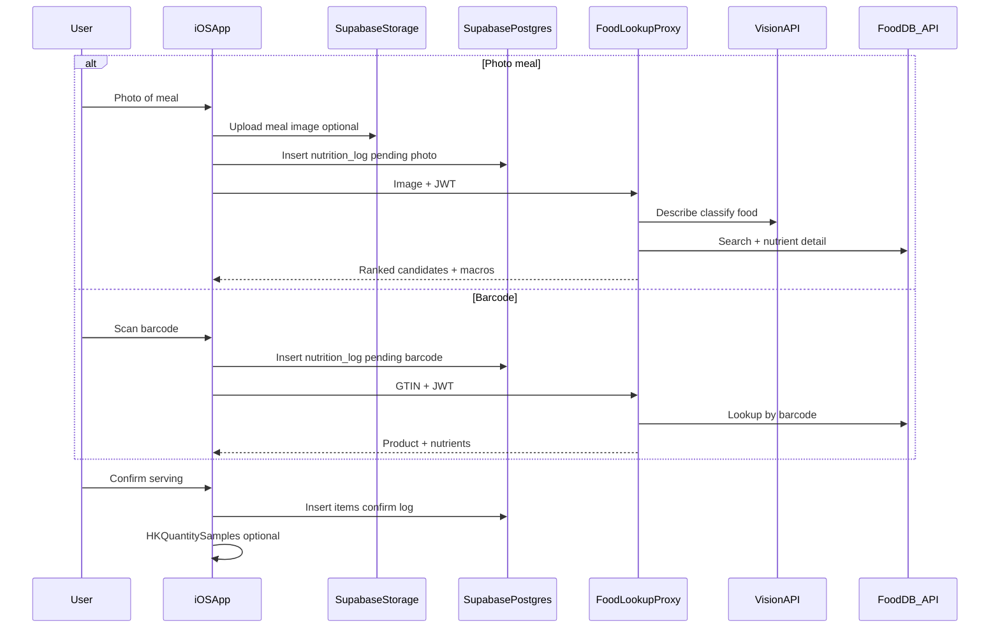

---

name: Nutrition tracking feature
overview: Add a dedicated Nutrition tab with photo-based food recognition and barcode scanning, resolving foods via a server-side proxy (default composite vision + USDA/Open Food Facts, or swappable specialized APIs such as Nutritionix or LogMeal), persisting to Supabase and Storage, with optional HealthKit writes for energy and macros.
todos:

- id: schema-rls-storage
content: Define nutrition_logs + nutrition_log_items (include source + optional barcode/GTIN), RLS policies, and private meal-photos Storage bucket in Supabase
status: completed
- id: analyze-proxy
content: "Implement analyze HTTPS service (Edge Function or alternate host): JWT verify → photo path (vision + USDA/OFF OR specialized API e.g. Nutritionix/LogMeal) OR barcode path (GTIN → OFF/USDA/vendor); normalize responses to shared JSON for the app"
status: completed
- id: ios-nutrition-tab
content: Add NutritionView/ViewModel, TabView entry, photo capture + barcode scanner + Storage upload + Supabase CRUD for logs/items
status: completed
- id: healthkit-write
content: Extend HealthKitManager for dietary share types and save samples after confirmed log; update onboarding/messaging
status: completed
- id: plist-privacy
content: Add NSCameraUsageDescription and photo library usage strings to Info.plist (camera shared by photo + barcode flows)
status: completed
isProject: false

---

*Saved copy of the nutrition feature design plan. Implementation in repo: migration `[supabase/migrations/20260407120000_nutrition.sql](../supabase/migrations/20260407120000_nutrition.sql)`, Edge Function `[supabase/functions/food-lookup/](../supabase/functions/food-lookup/)`, iOS `NutritionView.swift`, `NutritionManager.swift`, `NutritionModels.swift`.*

# Nutrition tracking (photo + barcode → food DB → macros)

The app supports **both**:

1. **Photo food recognition** — image → vision model → candidate foods → USDA (or similar) nutrient detail → user confirms portion.
2. **Barcode scanning** — GTIN/UPC/EAN from packaged product → **lookup by barcode** in a food database → usually a **single high-confidence product** (still allow edit/serving adjustment) → same `nutrition_log_items` row shape as photo flow.

Same Supabase tables and HealthKit write path for both; differ only in **how** the proxy resolves the product.

## Your question: vision + USDA without Edge Functions?

**Yes.** The same design works if the “analyze meal” / “lookup food” endpoint runs anywhere you can keep secrets: **Cloudflare Worker, Vercel serverless, AWS Lambda, Fly.io, etc.** The iOS app only needs a stable HTTPS URL. **Supabase Edge Functions are convenient in this repo** because you already have `[supabase/functions/admin-actions/index.ts](../supabase/functions/admin-actions/index.ts)` and a Supabase project, but they are not required.

**Avoid** putting OpenAI (or USDA / third-party barcode API) keys in the shipped app binary; use a small proxy that validates the caller (e.g. requires a valid Supabase JWT via `Authorization: Bearer` and checks `sub` matches the body’s `user_id`, or uses a short-lived signed URL pattern).

## Current app touchpoints

- **Tabs:** Main shell is `[HealthTracker/ContentView.swift](../HealthTracker/ContentView.swift)` (`TabView` with Dashboard, My Data, Community, Profile). A **fifth tab** (e.g. “Nutrition”) fits the “major section” goal and matches existing patterns.
- **Backend access:** `[HealthTracker/AuthManager.swift](../HealthTracker/AuthManager.swift)` exposes `SupabaseClient`; `[HealthTracker/SyncManager.swift](../HealthTracker/SyncManager.swift)` shows the idiomatic `.from(...).upsert(...).execute()` style for writes.
- **HealthKit today:** `[HealthTracker/HealthKitManager.swift](../HealthTracker/HealthKitManager.swift)` requests **read-only** access (`toShare: []`). Writing dietary samples requires extending `requestAuthorization(toShare:read:)` with dietary quantity types and new save helpers.
- **Permissions:** `[HealthTracker/Info.plist](../HealthTracker/Info.plist)` currently has no camera/photo usage strings; **NSCameraUsageDescription** (and likely **NSPhotoLibraryUsageDescription** / limited picker as needed) must be added. **One camera permission** covers both meal photos and live barcode scanning.

## Target architecture

**FoodDB_API** in implementation may be **USDA FoodData Central** (branded foods with UPC/GTIN where available), **Open Food Facts** (strong free barcode coverage), or a **chain** (OFF for barcode → map to USDA `fdc_id` when possible). The plan is database-agnostic at the UI layer: store `fdc_id` and/or external product id in `nutrition_log_items`.

## 1. Supabase data model

Author SQL in the Supabase dashboard (or add a tracked migration file under `supabase/migrations/` if you want it versioned locally—**none exist today**).

**Suggested tables**

- `**nutrition_logs`**: `id`, `user_id` (FK `auth.users`), `logged_at` (timestamptz), optional `meal_type`, `**source`** (`photo` | `barcode` | `manual`), optional `**barcode_raw**` (text, normalized GTIN for barcode flows), optional `photo_path` (Storage path; null for barcode-only logs), `status` (`pending` | `confirmed`), `created_at`.
- `**nutrition_log_items**`: `id`, `log_id` (FK), `name`, optional `brand`, `serving_amount`, `serving_unit`, `grams` (nullable), `calories`, `protein_g`, `carb_g`, `fat_g`, `fiber_g`, `sodium_mg` (nullable), `fdc_id` (nullable), optional `**external_product_id**` (e.g. Open Food Facts code), optional `nutrients` **jsonb** for extras.

**RLS**: `user_id = auth.uid()` on logs; items join through log ownership.

**Storage**: Private bucket e.g. `meal-photos`, path pattern `{user_id}/{log_id}.jpg`, with RLS policies so users read/write only their prefix. Barcode-only logs may omit `photo_path`.

**Indexes**: `(user_id, logged_at desc)` for feed/history queries; optional index on `barcode_raw` only if you dedupe or analytics (usually unnecessary at MVP).

## 2. Food lookup proxy (Edge Function optional)

Implement one (or two routed) HTTP handler(s) in `supabase/functions/...` *or* your chosen host:

**Shared**

1. **Validate** Supabase JWT and optional `user_id` match.

**Photo path**

1. Multimodal vision: food description + ranked candidate names.
2. Food DB: search + nutrient detail; map to serving (estimated grams or default).
3. **Response**: JSON array of candidates with macros and stable ids (`fdc_id` / external).

**Barcode path**

1. Accept normalized **GTIN** (8/12/13/14 digits); reject invalid checksum where applicable.
2. Food DB: **barcode lookup** (e.g. Open Food Facts `product/{code}` and/or USDA branded search by UPC).
3. **Response**: Single primary product (plus optional alternates if API returns ambiguity) with nutrients per serving; user can still adjust quantity before save.

**Cost/accuracy note:** Barcode is usually **more deterministic** than photos; photos of mixed plates remain noisy—always support **confirmation** and **editable portions** for both paths.

**Swappable backend:** The iOS app should only talk to **your** proxy. Inside the proxy, you can replace USDA/OFF with a **specialized commercial API** (below) without changing the tab UI—map vendor responses into the same candidate + macros JSON shape you persist.

## 2b. Specialized API options vs current plan (composite stack)

**Current plan (baseline):** Multimodal **vision** (e.g. OpenAI, Gemini) for photo understanding → **USDA FoodData Central** for nutrients + **Open Food Facts** for barcode-heavy / international packaged goods (often chained: barcode → OFF, text search → USDA).

|                                                                           | **Pros**                                                                                                                                                                                                             | **Cons**                                                                                                                                                                                                |
| ------------------------------------------------------------------------- | -------------------------------------------------------------------------------------------------------------------------------------------------------------------------------------------------------------------- | ------------------------------------------------------------------------------------------------------------------------------------------------------------------------------------------------------- |
| **Composite: vision + USDA + OFF**                                        | No single nutrition vendor lock-in; USDA is strong for generic/standard foods; OFF is free and excellent for barcodes; you control prompts and fallbacks; predictable separation of “recognize” vs “nutrient facts.” | You maintain more code (prompts, search ranking, serving math); photo accuracy depends on vision model + search glue, not a meal-specific model; multiple API keys and rate limits to manage.           |
| **[Nutritionix](https://www.nutritionix.com/business/api)**               | Popular in health apps; natural language + branded foods; barcode and product-oriented flows; structured nutrient payloads; can reduce time-to-market vs rolling your own chain.                                     | Commercial pricing and ToS; dependency on their database IDs; still should not ship **app keys** in the client—proxy required; photo/“instant” features may differ by tier/product—verify current docs. |
| **[Edamam](https://developer.edamam.com/)**                               | Food Database + Parser APIs; good for **text** parsing (“2 eggs and toast”) and lookup; clear developer focus.                                                                                                       | Nutrition analysis often split across products; barcode/photo coverage may be weaker or different than Nutritionix—verify; pricing tiers; vendor lock-in for IDs.                                       |
| **[Spoonacular](https://spoonacular.com/food-api)**                       | Large food/recipe surface; ingredient and product-style queries; useful if you later blend recipes and logging.                                                                                                      | General-purpose API—not solely “diet logging”; quotas/pricing; check barcode vs image endpoints for your exact flows; terms suited to consumer apps but still third-party data.                         |
| **[FatSecret Platform API](https://platform.fatsecret.com/)**             | Long-standing food diary platform API; barcode and food search are common use cases.                                                                                                                                 | Branding/attribution and platform rules; commercial agreement; less “modern AI photo” narrative—confirm image/AI features if you rely on them.                                                          |
| **[LogMeal](https://logmeal.com/api/)** (and similar **meal-image** APIs) | **Purpose-built for food photos**; can outperform generic vision + text search on plates and mixed dishes.                                                                                                           | Additional vendor and cost; barcode may still need a second source (e.g. OFF); another integration to operate.                                                                                          |
| **[Passio](https://passiolife.com/)** (SDK)                               | On-device / SDK-style **food recognition**; can lower latency and repeated cloud image transfer; good UX story for privacy-sensitive users.                                                                          | SDK footprint, licensing, and release process; not a drop-in REST proxy—different integration shape; you may still want a server path for account sync and barcode.                                     |

**How to choose**

- Optimize for **lowest integration risk + barcode + branded US foods**: evaluate **Nutritionix** or **FatSecret** behind the proxy first.
- Optimize for **best plate-photo quality** with less custom ML: add or substitute **LogMeal** (or similar) for the photo path only; keep **OFF** or vendor barcode for scan path.
- Optimize for **cost control + transparency**: keep **composite (vision + USDA + OFF)** and invest in UX around confirmation and portions.

## 3. iOS app work

| Area           | Work                                                                                                                                                                                                                                                                                                                                                                                                                                                                                                     |
| -------------- | -------------------------------------------------------------------------------------------------------------------------------------------------------------------------------------------------------------------------------------------------------------------------------------------------------------------------------------------------------------------------------------------------------------------------------------------------------------------------------------------------------- |
| **Navigation** | New root view (e.g. `NutritionView`) + `NutritionViewModel`; add tab in `[HealthTracker/ContentView.swift](../HealthTracker/ContentView.swift)`.                                                                                                                                                                                                                                                                                                                                                         |
| **Photo**      | `PhotosUI` (library) + camera capture; compress JPEG before Storage upload when used.                                                                                                                                                                                                                                                                                                                                                                                                                    |
| **Barcode**    | Live scanner using **Vision** (`VNDetectBarcodesRequest`) or **VisionKit** `DataScannerViewController` (where deployment target allows); shared camera permission string with photo flow.                                                                                                                                                                                                                                                                                                                |
| **Networking** | Codable models for logs/items; Storage upload via Supabase client; REST calls to proxy (`multipart` image vs JSON `{ barcode }`), configured via build setting or plist—no secrets in binary.                                                                                                                                                                                                                                                                                                            |
| **UI**         | Day list + “Log meal” with explicit actions: **Scan barcode**                                                                                                                                                                                                                                                                                                                                                                                                                                            |
| **HealthKit**  | Extend `[HealthTracker/HealthKitManager.swift](../HealthTracker/HealthKitManager.swift)`: add **share** types (`dietaryEnergyConsumed`, `dietaryProtein`, `dietaryCarbohydrates`, `dietaryFatTotal`, optionally fiber/sodium); `saveNutritionSample(...)` using the meal’s `logged_at` as sample date; gate behind user toggle. Update onboarding copy where HealthKit is explained (`[HealthTracker/OnboardingView.swift](../HealthTracker/OnboardingView.swift)` if that’s where authorization lives). |

## 4. Phasing (keeps the first ship focused)

1. **MVP**: Manual “add food” + text search (proxy or direct search endpoint) without camera, to validate schema + UI + HealthKit writes.
2. **V1 recognition**: **Photo path** + **Barcode path** + shared confirmation UI + Storage for photo logs.
3. **V2 polish**: Favorites/recents, weekly trends, optional `daily_stats` / DB view for cross-feature dashboards, richer micronutrient UI.

## 5. Verification

Per project rules: run `xcodebuild` after Swift changes. No automated tests in repo; successful build is the gate.