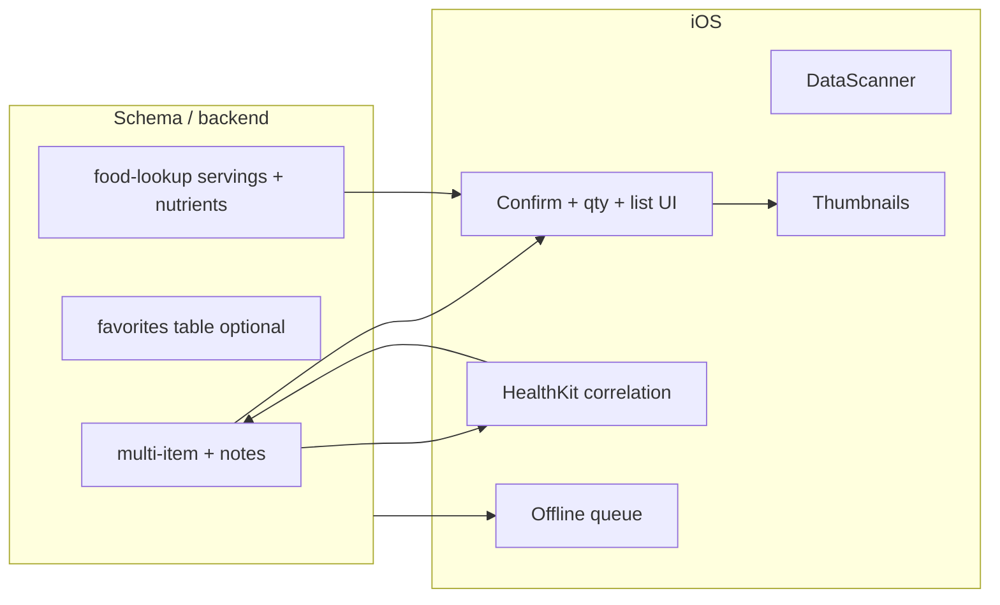

# Nutrition V1.1 — implementation plan

This document expands **Optional V1.1** from [nutrition_v1_recognition_plan.md](./nutrition_v1_recognition_plan.md) plus related enhancements: **multi-item photo logging**, **VisionKit DataScanner**, **meal list thumbnails**, **favorites/recents**, **meal notes**, **typical serving / household measures from OFF and USDA applied to entries**, **per-item serving quantity** (e.g. “2 pancakes” without manually doubling grams), **extended nutrition data for reference**, **Apple Health updates on edit**, and an **offline/retry queue**.

It is grounded in the current codebase: one `nutrition_log` + one `nutrition_log_items` row per save in `NutritionManager.saveMeal`, explicit “does not modify Apple Health” in `NutritionManager.updateLog`, and HK writes without log correlation in `HealthKitManager.saveNutritionFromMeal`.

---

## Dependency overview

**Suggested build order:** enrich `**food-lookup`** (typical serving + extended nutrients) and wire **confirm/save** → schema for notes + (optional) favorites → multi-item confirm/save → thumbnails (signed URLs) → HealthKit metadata + edit/delete path → DataScanner (swap scanner) → offline queue (touches save + lookup) → favorites/recents UI.

---

## 1. Multi-item photo logging

**Goal:** One photo → one `nutrition_log` (single `photo_path`, `source: photo`) → **multiple** `nutrition_log_items` rows. Confirmation UI supports selecting several candidates with per-item portions (reuse grams scaling from `ConfirmFoodSheet` in `NutritionView.swift`).

**Backend:** No migration strictly required if you only add rows to `nutrition_log_items` (already FK’d to `log_id`). Edge `food-lookup` already returns multiple candidates; the gap is client-side “pick many” and `saveMeal` inserting **N** items in one transaction.

**iOS work:**

- Extend `MealSaveInput` (or replace with a batch type) to carry `[FoodCandidateDTO]` plus shared `photoJPEG`, `loggedAt`, `mealType`.
- `NutritionManager.saveMeal`: single log insert → optional storage upload once → **loop** `ItemInsert` (or one batched insert if PostgREST batch is preferred). Each line item carries its own **serving quantity** (see §6) when that ships.

**HealthKit:** Either **one aggregated** `saveNutritionFromMeal` call (sum macros) at the same `logged_at`, or multiple samples with tiny time offsets—pick one product rule and document it; aggregated matches current behavior and avoids clutter.

**Exit criteria:** Photo flow can add 2+ lines; list and totals match sum of items; one thumbnail still maps to one log.

---

## 2. DataScanner (VisionKit)

**Goal:** Replace or supplement `BarcodeScannerViewController` in `NutritionView.swift` (AVFoundation metadata) with `DataScannerViewController` for barcode scanning where available.

**Constraints:** DataScanner requires iOS 16+, device support, and `DataScannerViewController.isSupported`. Keep the AVFoundation path as fallback when unsupported.

**iOS work:**

- New `UIViewControllerRepresentable` (or branch inside `BarcodeScannerView`) with `#available` / `isSupported`.
- Map scanned string → existing `NutritionManager.lookupBarcode` (no Edge change).
- Reuse torch / single-fire behavior; align delegate flow with current UX (dismiss on first valid GTIN).

**Exit criteria:** Supported devices use DataScanner; unsupported use current scanner; no regression on lookup errors/notices.

---

## 3. Meal list thumbnails from `photo_path`

**Goal:** Rows with `photo_path` show a small async thumbnail.

**Access:** Bucket `meal-photos` is private; the app uploads but does not yet read. Add a helper on `NutritionManager` (or dedicated type): **create signed URL** (short TTL, e.g. 1 hour) via Supabase Swift client, or authenticated download. Cache in memory (`NSCache` keyed by `log.id` + path) to avoid re-signing every scroll.

**iOS work:**

- List cell: if `photo_path != nil`, show `AsyncImage` or custom loader using signed URL; placeholder for barcode/manual.
- Optionally prefetch visible rows.

**Exit criteria:** Scrolling today’s list does not hammer the network (cache + reasonable TTL).

---

## 4. Favorites / recents

**Goal:** Fast re-pick of foods without full search every time.

| Approach                                                                                                     | Pros               | Cons            |
| ------------------------------------------------------------------------------------------------------------ | ------------------ | --------------- |
| **Local only** (UserDefaults)                                                                                | Fast, no migration | No cross-device |
| **Supabase** `nutrition_favorites` (`user_id`, snapshot JSON or `fdc_id` / `external_product_id`, `name`, …) | Sync               | Migration + RLS |

**Recents:** Derived from last N successful saves (query `nutrition_log_items` joined to logs) or a lightweight local LRU keyed by stable food identifiers.

**iOS work:** Chip row or section above search in `LogFoodSheet`; tap fills the confirmation model. Server favorites need CRUD with RLS.

**Exit criteria:** User can add from favorites/recents in ≤2 taps after first use.

---

## 5. Meal notes

**Goal:** Free-text note per meal (not per line item).

**Schema:** Add `notes TEXT` (nullable) to `nutrition_logs` via a new migration; extend `NutritionLogRow`, Supabase select strings, and insert/patch structs in `NutritionManager.swift`.

**iOS work:** Text field on confirm sheet and/or log detail/edit; optional character limit.

**Exit criteria:** Note round-trips in list/detail/edit.

---

## 6. Typical serving / household measure (OFF + USDA) → nutrition entry

**Goal:** Stop defaulting every candidate to an implicit **100 g** baseline when the source provides a **label serving** or **household measure**. Pre-fill confirmation (grams / “1 serving”) from authoritative product data, while keeping user override and scaling behavior.

**Current state:** `[supabase/functions/food-lookup/index.ts](../supabase/functions/food-lookup/index.ts)` builds candidates with fixed `serving_amount: 100`, `grams: 100`, `"per 100 g"`, using mostly `*_100g` nutriments (OFF) or search `foodNutrients` (USDA). OFF product JSON already exposes fields such as `**serving_size`**, `**nutrition_data_per`**, and `**nutriments**` keys for per-serving values; those are unused today. USDA search is abridged; detail `GET /fdc/v1/food/{fdcId}` exposes branded `**servingSize**`, `**servingSizeUnit**`, `**householdServingFullText**`, and (non-branded) `**foodPortions**` with gram weights.

**Edge (`food-lookup`) work:**

- **Open Food Facts (barcode + search product objects):** Parse `serving_size` (string normalization to grams where possible), honor `**nutrition_data_per`** when choosing per-serving vs per-100g nutriments, and map to a single **primary candidate** with consistent macros for that basis. Expose optional fields on the candidate payload, e.g. `**household_serving_text`** (verbatim label line) and `**typical_serving_grams`** (numeric when derivable).
- **USDA:** When a hit includes `**fdc_id`**, call `**/fdc/v1/food/{fdcId}`** (with `USDA_API_KEY`) to read branded serving fields or `foodPortions`; choose a default portion (e.g. first labeled serving or 100 g fallback) and return the same optional serving metadata + macros aligned to that portion.
- **Fallbacks:** If parsing fails or data is missing, keep today’s **100 g** behavior. Document precedence when both per-serving and per-100g exist (prefer consumer-facing label serving for packaged goods when trustworthy).

**iOS work:**

- Extend `FoodCandidateDTO` / decode keys for serving metadata; initialize `ConfirmFoodSheet` from `typical_serving_grams` / household text instead of raw 100 g when present.
- Refine scaling: treat the candidate’s macros and grams as **per one nutritional serving** (one pancake, one label portion, or 100 g when that is the basis)—then apply **quantity** below.

### Serving quantity (count) vs doubling grams

**Goal:** Let the user say **how many** of that serving they ate—e.g. **2 pancakes**—without typing **2×** the gram weight by hand. Quantity multiplies **one row of label nutrition**, not a second independent scaling knob that fights grams.

**UX:**

- Primary control: **Quantity** (stepper, `+`/`−`, or numeric field), default **1**, with copy tied to the household line when available (“1 pancake — 41 g” → quantity 2 means “2 pancakes”).
- Macros and **total grams** preview update as `**perServing × quantity`** (and extended nutrients in §7 scale the same way when you store totals or per-serving + qty consistently).
- **Advanced / power path:** Optional “Edit total grams” (or the existing grams field) still available. Define behavior when both change: e.g. editing total grams sets **quantity = 1** and stores that mass as the single custom portion, **or** recomputes `quantity = totalGrams / gramsPerServing` when divisible—pick one rule and stick to it in `updateLog`.

**Data model:**

- Add `**quantity`** on `nutrition_log_items` (e.g. `DOUBLE PRECISION NOT NULL DEFAULT 1`, so values like **1.5** slices are allowed). Migration + RLS unchanged.
- Persist **total consumed grams** in `grams` (recommended: `gramsPerServing × quantity`) so today’s totals, HealthKit aggregation, and `updateLog` rescaling keep a single canonical mass. Alternatively store `grams_per_serving` + `quantity` only and derive in the app—document which is source of truth for edits.
- Keep `serving_amount` / `serving_unit` aligned with the **label’s description of one counted unit** when the source provides it (e.g. `serving_unit: "pancake"`, `serving_amount: 1` per pancake); **quantity** is how many of those units were eaten.

**Exit criteria:** Barcode (or search) item with a clear household serving opens confirm with quantity **1** and correct per-serving macros; setting quantity to **2** doubles calories/macros/grams in the preview and in the saved row; user never has to manually double grams for the common case. Pure **100 g** foods behave as “1 × 100 g” with quantity still usable (e.g. **2.5** × 100 g).

---

## 7. Extended nutrition data for reference

**Goal:** Capture **more nutrients** than the six macros used for logging + HealthKit, for **in-app reference** (detail sheet, future trends), without committing to writing every field to HealthKit.

**Current state:** `nutrition_log_items` includes `**nutrients JSONB`** in `[supabase/migrations/20260407120000_nutrition.sql](../supabase/migrations/20260407120000_nutrition.sql)`, but inserts from the app may not populate it. OFF `**nutriments`** and USDA **detail** `foodNutrients` / `**labelNutrients`** expose many additional values (sugars, saturated fat, cholesterol, potassium, vitamins, etc., depending on source and coverage).

**Edge (`food-lookup`) work:**

- Define a **stable JSON shape** (e.g. `{ key: string, amount: number, unit: string, source: "off"|"usda" }[]` or a keyed map) for “extras,” mapped from known OFF nutriments keys and USDA nutrient IDs.
- Prefer **one detail fetch** per selected food where needed (USDA) so the response is not bloated for every search hit—e.g. return minimal candidates from search, attach `**nutrients_preview`** only when cheap, or add an optional `mode`/flag later; for V1.1, returning extended data for the **top candidate** or **all returned candidates** is acceptable if payload size stays bounded.
- Barcode (OFF): full product nutriments object is already available—subset + normalize units (mg vs g for sodium, etc.).

**iOS work:**

- Decode extended payload into a model; pass into confirm UI as a collapsible **“Nutrition facts (reference)”** section (clearly labeled as from database, not lab-tested).
- `**NutritionManager.saveMeal` / `ItemInsert`:** populate `**nutrients`** JSONB when saving; `**loadLogs`** select must include `nutrients` if present.
- **HealthKit:** unchanged unless you explicitly expand write types later; this item is **reference-only** unless product says otherwise.

**Exit criteria:** Saving a meal persists extra nutrients where the API provided them; user can view them on detail/confirm; macros and HK path remain correct.

---

## 8. Update Apple Health when an item or meal is edited

**Current state:** `saveMeal` writes HK quantities; `updateLog` does **not** sync HealthKit; `saveNutritionFromMeal` uses `metadata: nil`—no stable link for correction or deletion.

**Recommended approach:**

1. When writing nutrition samples, set **HKSample metadata**, e.g. a custom key such as `ht_nutrition_log_id` = log UUID string (confirm custom string metadata fits your HealthKit usage).
2. Add `HealthKitManager` APIs, e.g. `deleteNutritionSamples(forLogId:)`, using metadata predicates or fetch-then-delete for the quantity types you write.
3. After a **successful** DB update: if the user has “sync to Health” enabled, **delete** old samples for that `log.id`, then **write** new aggregated totals at the **new** `logged_at`. For multi-item logs, aggregate per log for HK unless you store one metadata key per line item.

**Edge cases:** If the user turned Health sync off after save, define whether edits skip HK or always reconcile (typical: only when toggle is on). **Deleting** a log should remove associated HK samples for that metadata key.

**Exit criteria:** Editing time, meal type, or grams updates Health without duplicates; deleting a log removes associated samples.

---

## 9. Offline / retry queue

**Scope:** Failed Edge `food-lookup` invocations and/or failed save (insert/storage upload) while offline.

**Design sketch:**

- **Queue entries** (Codable): kind (`lookupPhoto` | `lookupBarcode` | `lookupSearch` | `saveMeal`), payload (photo: JPEG file URL on disk; save: full meal snapshot), `id`, `createdAt`, `retryCount`.
- **Persistence:** File in Application Support + index, or single JSON with a cap on queued images (photos are already compressed—still cap queue depth).
- **Triggers:** `NWPathMonitor` when online; app foreground; optional background task later.
- **Behavior:** Exponential backoff; max retries; user-visible “Pending” state with retry/discard.
- **Idempotency:** If save succeeds locally but refresh fails, avoid duplicate HK writes (e.g. client id per queued save).

**Relation to multi-item:** Queue the **final** confirmed payload so replay is one network transaction.

**Exit criteria:** Airplane-mode save queues; reconnect processes or surfaces clear failure.

---

## Milestones (suggested)

| Milestone | Delivers                                                                                                                                                                                                                                |
| --------- | --------------------------------------------------------------------------------------------------------------------------------------------------------------------------------------------------------------------------------------- |
| **M1**    | `notes` column + UI; signed URL + list thumbnails                                                                                                                                                                                       |
| **M1b**   | `food-lookup`: typical serving / household from OFF + USDA detail; candidate DTO + confirm pre-fill; **per-item `quantity`** (× servings) with clear UX vs raw grams; `nutrients` JSONB populated + reference UI for extended nutrients |
| **M2**    | Multi-select confirm + multi-item insert + aggregated HK on save                                                                                                                                                                        |
| **M3**    | HK metadata + delete-on-edit / delete-on-log-delete                                                                                                                                                                                     |
| **M4**    | DataScanner with AVFoundation fallback                                                                                                                                                                                                  |
| **M5**    | Favorites / recents                                                                                                                                                                                                                     |
| **M6**    | Offline queue for lookup + save                                                                                                                                                                                                         |

---

## Decisions to lock early

- **HealthKit:** Aggregated sample per log vs per line item drives metadata and edit/delete logic.
- **Serving basis:** When OFF/USDA disagree or parsing is ambiguous, prefer label serving vs 100 g; show household text in UI for transparency.
- **Quantity vs grams:** When the user edits total grams directly, whether to reset quantity to 1, or to recompute quantity from `gramsPerServing`, or to hide quantity in “custom mass” mode—keep one consistent rule across save and `updateLog`.
- **Extended nutrients:** Which keys/IDs are in scope for v1.1 (e.g. sugars, saturated fat, cholesterol, sodium already on HK—still store for display consistency); cap payload size from search results vs lazy detail fetch.
- **Offline queue:** Auto-retry on cellular vs Wi‑Fi only (cost / user setting).
- **Favorites:** Local vs Supabase—prefer DB if cross-device or family features matter later.

---

## Key file references (repo)

| Area                             | Location                                           |
| -------------------------------- | -------------------------------------------------- |
| Save / load / update nutrition   | `HealthTracker/NutritionManager.swift`             |
| Models                           | `HealthTracker/NutritionModels.swift`              |
| UI (scanner, log sheet, confirm) | `HealthTracker/NutritionView.swift`                |
| HK nutrition write               | `HealthTracker/HealthKitManager.swift`             |
| Schema                           | `supabase/migrations/20260407120000_nutrition.sql` |
| Lookup API                       | `supabase/functions/food-lookup/index.ts`          |

